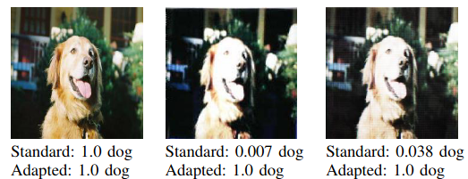

{{ page.authors }}

## Abstract

> Deep Learning systems have proven to be extremely successful for image recognition tasks for which significant amounts of training data is available, e.g., on the famous ImageNet dataset. We demonstrate that for robotics applications with cheap camera equipment, the low image quality, however, influences the classification accuracy, and freely available data bases cannot be exploited in a straight forward way to train classifiers to be used on a robot. As a solution we propose to train a network on degrading the quality images in order to mimic specific low quality imaging systems. Numerical experiments demonstrate that classification networks trained by using images produced by our quality degrading network along with the high quality images outperform classification networks trained only on high quality data when used on a real robot system, while being significantly easier to use than competing zero-shot domain adaptation techniques.
> 
## Resources

<a href=" {{ page.paperurl }} ">[pdf]</a> <a href=" {{ page.arxiv }} ">[arxiv]</a> <a href=" {{ page.code }} ">[github]</a> <a href=" {{ page.video }} ">[video]</a> <a href=" {{ page.poster }} ">[video]</a>

## Bibtex

@inproceedings{hegde2021simple,
  title={A Simple Domain Shifting Network for Generating Low Quality Images},
  author={Hegde, Guruprasad and Ramesh, Avinash Nittur and Gandikota, Kanchana Vaishnavi and Obermaisser, Roman and Moeller, Michael},
  booktitle={25th International Conference on Pattern Recognition (ICPR)},
  year={2020},
  organization={IEEE}
}

