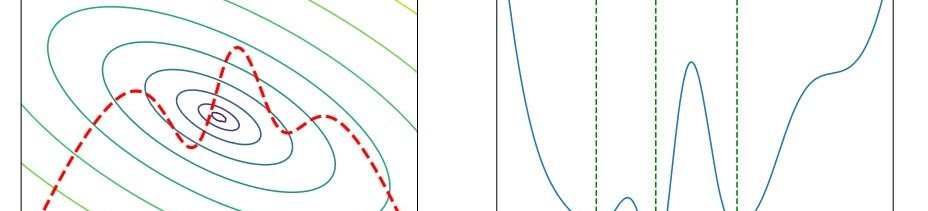

{{ page.authors }}

## Abstract

> This paper provides an overview of current approaches for solving inverse problems in imaging using variational methods and machine learning. A special focus lies on point estimators and their robustness against adversarial perturbations. In this context results of numerical experiments for a one-dimensional toy problem are provided, showing the robustness of different approaches and empirically verifying theoretical guarantees. Another focus of this review is the exploration of the subspace of data-consistent solutions through explicit guidance to satisfy specific semantic or textural properties.
## Resources

<a href=" {{ page.paperurl }} ">[pdf]</a> <a href=" {{ page.arxiv }} ">[arxiv]</a> <a href=" {{ page.code }} ">[github]</a> <a href=" {{ page.video }} ">[video]</a> <a href=" {{ page.poster }} ">[video]</a>

## Bibtex

    @article{https://doi.org/10.1002/gamm.202470003,
author = {Auras, Alexander and Gandikota, Kanchana Vaishnavi and Droege, Hannah and Moeller, Michael},
title = {Robustness and exploration of variational and machine learning approaches to inverse problems: An overview},
journal = {GAMM-Mitteilungen},
volume = {n/a},
number = {n/a},
pages = {e202470003},
keywords = {explorability, inverse problems, machine learning, robustness},
doi = {https://doi.org/10.1002/gamm.202470003},
url = {https://onlinelibrary.wiley.com/doi/abs/10.1002/gamm.202470003},
eprint = {https://onlinelibrary.wiley.com/doi/pdf/10.1002/gamm.202470003},
abstract = {Abstract This paper provides an overview of current approaches for solving inverse problems in imaging using variational methods and machine learning. A special focus lies on point estimators and their robustness against adversarial perturbations. In this context results of numerical experiments for a one-dimensional toy problem are provided, showing the robustness of different approaches and empirically verifying theoretical guarantees. Another focus of this review is the exploration of the subspace of data-consistent solutions through explicit guidance to satisfy specific semantic or textural properties.}
}
