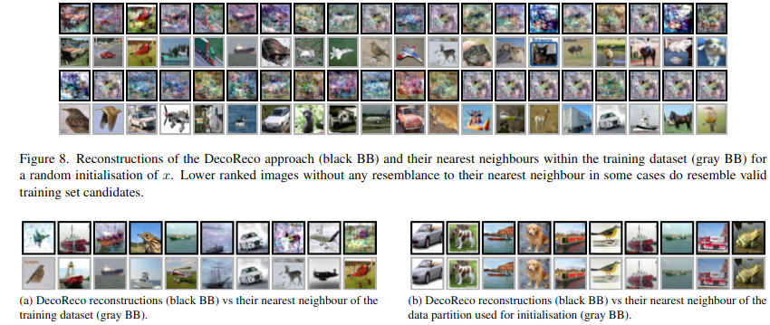

{{ page.authors }}

## Abstract

> Being able to reconstruct training data from the parameters of a neural network is a major privacy concern. Previous works have shown that reconstructing training data, under certain circumstances, is possible. In this work, we analyse such reconstructions empirically and propose a new formulation of the reconstruction as a solution to a bilevel optimisation problem. We demonstrate that our formulation as well as previous approaches highly depend on the initialisation of the training images x to reconstruct. In particular, we show that a random initialisation of x can lead to reconstructions that resemble valid training samples while not being part of the actual training dataset. Thus, our experiments on affine and one-hidden layer networks suggest that when reconstructing natural images, yet an adversary cannot identify whether reconstructed images have indeed been part of the set of training samples. 
## Resources

<a href=" {{ page.paperurl }} ">[pdf]</a> <a href=" {{ page.arxiv }} ">[arxiv]</a> <a href=" {{ page.code }} ">[github]</a> <a href=" {{ page.video }} ">[video]</a> <a href=" {{ page.poster }} ">[video]</a>

## Bibtex

    @InProceedings{Runkel_2025_CVPR,
    author    = {Runkel, Christina and Gandikota, Kanchana Vaishnavi and Geiping, Jonas and Sch\"onlieb, Carola-Bibiane and Moeller, Michael},
    title     = {Training Data Reconstruction: Privacy due to Uncertainty?},
    booktitle = {Proceedings of the IEEE/CVF Conference on Computer Vision and Pattern Recognition (CVPR) Workshops},
    month     = {June},
    year      = {2025},
    pages     = {3511-3519}
}
