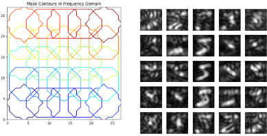

---

title: "Direct Image Classification from Fourier Ptychographic Microscopy Measurements without Reconstruction"
collection: publications
permalink: /publication/2025_CVPRW
date: 2025-06-05
venue: 'International Symposium on Computational Sensing'
paperurl: 'https://arxiv.org/pdf/2505.05054'
authors: 'Navya Sonal Agarwal, Jan Philipp Schneider, <b>Kanchana Vaishnavi Gandikota</b>, Syed Muhammad Kazim, John Meshreki, Ivo Ihrke, Michael Moeller'
teaser: /previews/cvprw25iscs.png
arxiv: 'https://arxiv.org/abs/2505.05054'
categories: [Fourier Ptychography, Computational Imaging]
bibtex: true
---

{{ page.authors }}

## Abstract

> The computational imaging technique of Fourier Ptychographic Microscopy (FPM) enables high-resolution imaging with a wide field of view and can serve as an extremely valuable tool, e.g. in the classification of cells in medical applications. However, reconstructing a high-resolution image from tens or even hundreds of measurements is computationally expensive, particularly for a wide field of view. Therefore, in this paper, we investigate the idea of classifying the image content in the FPM measurements directly without performing a reconstruction step first. We show that Convolutional Neural Networks (CNN) can extract meaningful information from measurement sequences, significantly outperforming the classification on a single band-limited image (up to 12 %) while being significantly more efficient than a reconstruction of a high-resolution image. Furthermore, we demonstrate that a learned multiplexing of several raw measurements allows maintaining the classification accuracy while reducing the amount of data (and consequently also the acquisition time) significantly. 
## Resources

<a href=" {{ page.paperurl }} ">[pdf]</a> <a href=" {{ page.arxiv }} ">[arxiv]</a> <a href=" {{ page.code }} ">[github]</a> <a href=" {{ page.video }} ">[video]</a> <a href=" {{ page.poster }} ">[video]</a>

## Bibtex

    @misc{agarwal2025directimageclassificationfourier,
      title={Direct Image Classification from Fourier Ptychographic Microscopy Measurements without Reconstruction}, 
      author={Navya Sonal Agarwal and Jan Philipp Schneider and Kanchana Vaishnavi Gandikota and Syed Muhammad Kazim and John Meshreki and Ivo Ihrke and Michael Moeller},
      year={2025},
      eprint={2505.05054},
      archivePrefix={arXiv},
      primaryClass={eess.IV},
      url={https://arxiv.org/abs/2505.05054}, 
}
